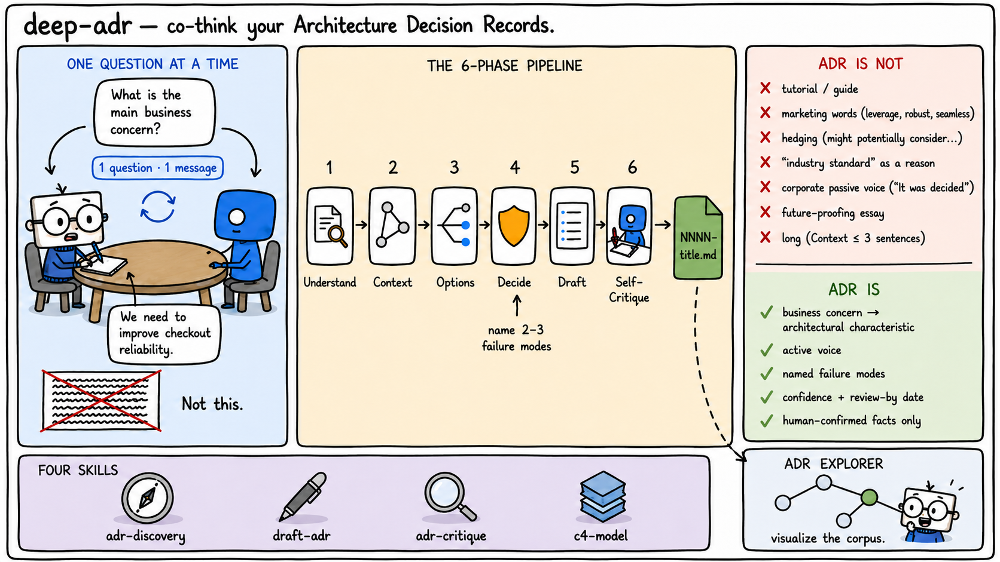
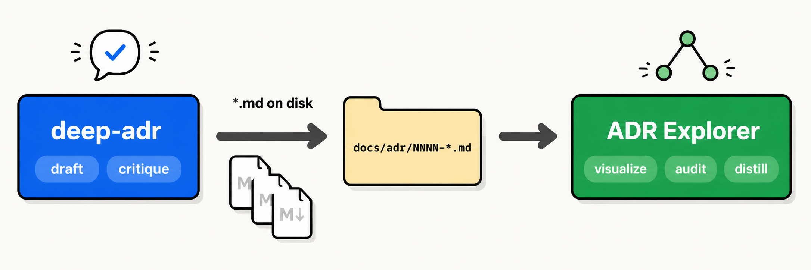
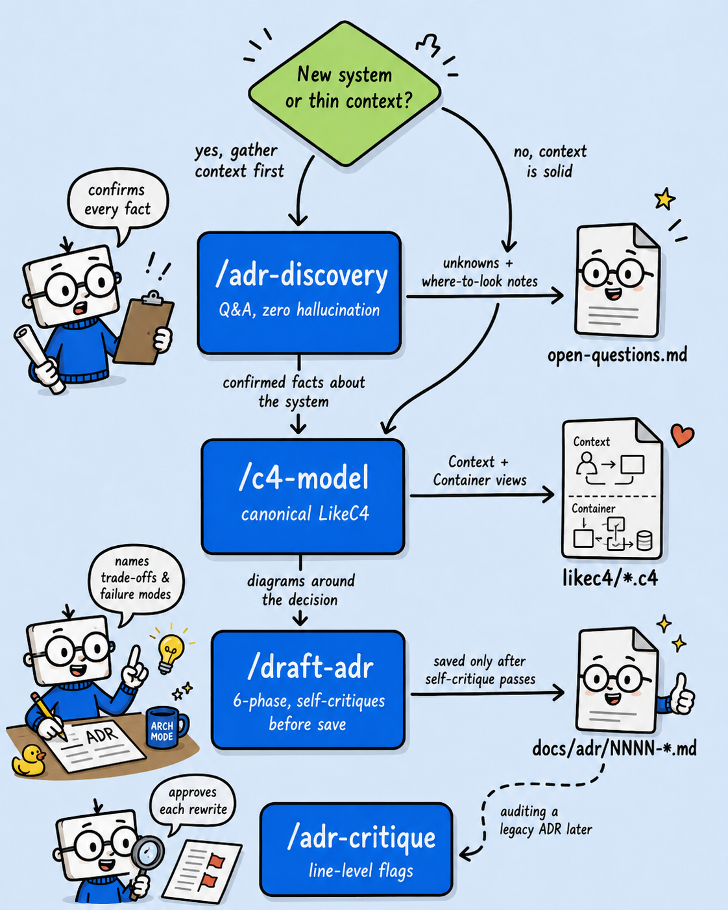

# deep-adr

A family of four Claude skills that co-think Architecture Decision Records with the architect — challenging, pushing back, and refusing to write an ADR until the reasoning holds up. Designed to fix the failure mode of AI-generated ADRs stuffed with filler, hedging, and implementation detail.

These are **not** template fillers. They behave like a senior architect in a review.



## Quick start

```bash
npx skills add janmohammadi/deep-adr --all
```

Then invoke any skill from your agent: `/adr-discovery`, `/draft-adr`, `/adr-critique`, `/c4-model`. For GitHub Copilot or per-skill installs, see [Install](#install) below.

> **Pairs with [ADR Explorer](https://github.com/janmohammadi/adr-explorer)** — once `deep-adr` has helped you produce a corpus of ADRs on disk, ADR Explorer visualizes the graph (`supersedes` / `amends` / `relates-to`), scores corpus health, surfaces stale or orphan decisions, and can distill bloat. Available as `npx adr-explorer` or as a [VS Code extension](https://marketplace.visualstudio.com/items?itemName=reza-janm.adr-explorer).



## The four skills

| Skill | When to use |
|---|---|
| [`adr-discovery`](skills/adr-discovery/SKILL.md) | Before drafting, especially on unfamiliar systems. Gathers project context through back-and-forth Q&A with **zero hallucination** — every fact confirmed by the human before it counts. Logs unknowns to `docs/architecture/open-questions.md` with where-to-look / who-to-ask guidance. |
| [`draft-adr`](skills/draft-adr/SKILL.md) | When the architect has a decision to make. Co-thinks through Understand → Context → Options → Decide → Draft → **Self-Critique** → Save. Pushes back, enforces "ADR is NOT" rules on its own output before saving. 6-phase flow; refuses to write if context is thin or reasoning is weak. |
| [`adr-critique`](skills/adr-critique/SKILL.md) | Auditing an existing or legacy ADR that wasn't drafted via `draft-adr`. Line-level flags against the ADR-is-NOT checklist with per-line rewrite approval. Catches missing-why, inconsistency, and LikeC4 drift. |
| [`c4-model`](skills/c4-model/SKILL.md) | Generating a **canonical-C4** LikeC4 model from confirmed architectural elements. Context + Container views only, optionally Deployment. Refuses Component views, custom element kinds, dynamic views, and other LikeC4 features that deviate from Simon Brown C4 conventions. |

## Typical workflow



## What makes these different

- **Zero hallucination** — `adr-discovery` never states a fact about the project the human hasn't confirmed. Every finding from code is presented as *"I found X in [file]. Is this accurate?"* and waits for a yes/no. Business domain, component purpose, and relationships are always asked, never inferred.
- **Push-back, not capitulation** — `draft-adr` is scripted to challenge weak reasoning, name the strongest counter-argument, and require the architect to articulate 2–3 failure modes before accepting a decision. Forbidden affirmations: "Great question", "Solid approach", "Good thinking".
- **Self-critique before save** — `draft-adr` runs the ADR-IS-NOT checklist on its own draft output, quotes violating lines, rewrites them, and presents the revised draft for approval. You never see its first draft.
- **Canonical-C4 by construction** — `c4-model` locks LikeC4's flexible DSL to the Simon Brown C4 Model style. No Component views, no custom kinds, no dynamic views. In-skill lint runs before `likec4 validate`.
- **Open-questions mechanism** — when the architect doesn't know something, the skills don't fabricate. They help scope the answer (where to look, who to ask) and log to `docs/architecture/open-questions.md` — a path deliberately outside the four directories typically scanned by ADR parsers.

## Install

### Claude Code, Cursor, OpenCode, etc. (via `skills` CLI)

Install all four skills to any supported agent via the [`skills`](https://github.com/vercel-labs/skills) CLI:

```bash
# install all four
npx skills add janmohammadi/deep-adr --all

# install one
npx skills add janmohammadi/deep-adr --skill draft-adr

# target a specific agent
npx skills add janmohammadi/deep-adr --all --agent claude-code

# list what's available without installing
npx skills add janmohammadi/deep-adr --list
```

### GitHub Copilot

The `skills` CLI's `--agent github-copilot` option copies `SKILL.md` files to `.agents/skills/`, but Copilot Chat doesn't read that directory — it reads `.github/prompts/*.prompt.md` for slash-invokable prompts. To work around this, we ship **pre-built Copilot prompt files** in [.github/prompts/](.github/prompts/) alongside the canonical `skills/*/SKILL.md`.

**To use in your project:**

```bash
# clone or download this repo, then copy the prompt files into your project
mkdir -p .github/prompts
cp -r /path/to/deep-adr/.github/prompts/*.prompt.md .github/prompts/
```

Or, using `curl`:

```bash
mkdir -p .github/prompts
for name in adr-discovery draft-adr adr-critique c4-model; do
  curl -fsSL "https://raw.githubusercontent.com/janmohammadi/deep-adr/main/.github/prompts/$name.prompt.md" \
    -o ".github/prompts/$name.prompt.md"
done
```

Open the VS Code Copilot Chat and invoke: `/adr-discovery`, `/draft-adr`, `/adr-critique`, `/c4-model` — the slash-command picker lists them automatically.

**Keeping `SKILL.md` and `.prompt.md` in sync (maintainers only):**

The `.prompt.md` files are generated from the canonical `skills/*/SKILL.md` by a plain Node script. If you edit a skill, regenerate:

```bash
node scripts/build-copilot-prompts.mjs
```

No dependencies — uses only Node's built-ins.

## Requirements

- **Claude Code** or any agent supported by the `skills` CLI; OR **GitHub Copilot** in VS Code (see Copilot install section above).
- **LikeC4 CLI** (required only for `c4-model`): `npx likec4 validate` and `npx likec4 start`.
- **Node.js** (optional, only for maintainers who want to regenerate the Copilot prompt files after editing a `SKILL.md`).

## ADR is NOT

Every skill enforces the same checklist on ADR content:

```
An ADR is NOT:
- A tutorial. Don't explain what REST is, what a queue is, what Kafka does.
- An implementation guide. No code snippets except fitness functions.
- A marketing doc. No "leverage", "robust", "scalable", "enterprise-grade",
  "best-in-class", "industry-leading", "seamless", "cutting-edge".
- A hedge. No "it might be good to consider potentially evaluating...".
- A generic best-practice citation. "Industry standard" is not a reason.
- A probability-weighted LLM summary. If the only justification is "this is
  how most teams do it", that is an abdication, not a justification.
- A future-proofing essay. Decisions are made for known forces today.
- Corporate passive voice. "It was decided" is wrong. "We use X" is right.
- A design doc. Implementation detail belongs in the design doc or the code.
- Long. Context ≤ 3 sentences. Decision ≤ 3 sentences. Consequences as bullets.
```

## Inspired by

<a href="https://learning.oreilly.com/library/view/fundamentals-of-software/9781492043447/"></a>

The ADR philosophy baked into these skills draws heavily from **[Fundamentals of Software Architecture](https://learning.oreilly.com/library/view/fundamentals-of-software/9781492043447/)** by Mark Richards and Neal Ford (O'Reilly, 2020) — in particular **Chapter 19, "Architecture Decisions"**. The chapter's framing of ADRs as records of *why* (not *what*), its emphasis on stating consequences honestly, and its warnings against trivial or implementation-detail decisions all show up in the "ADR is NOT" checklist and the push-back behavior of `draft-adr` and `adr-critique`.

If you find these skills useful, read the chapter — it explains the *reasoning* behind the rules the skills enforce.

## License

MIT — see [LICENSE](LICENSE).
